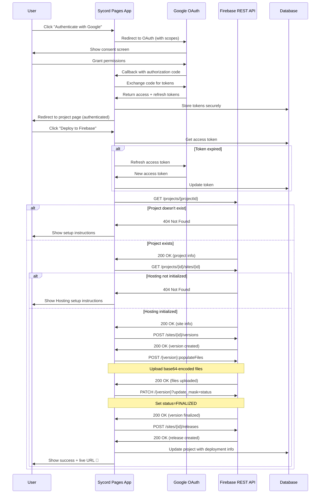
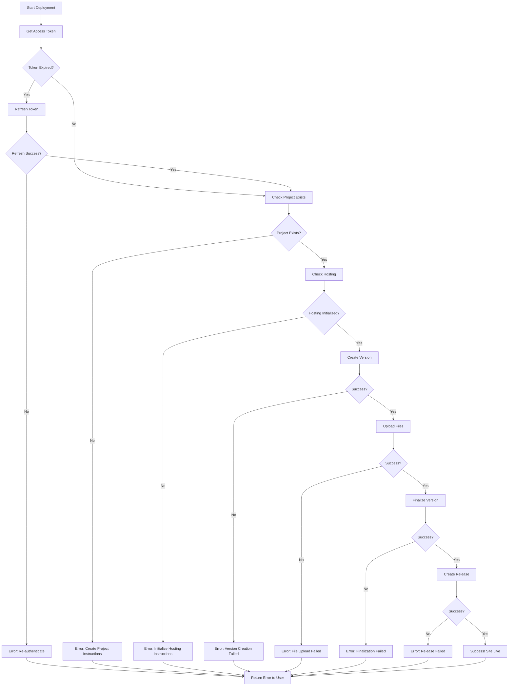

# Firebase Deployment Workflow Diagram

## Complete Deployment Flow



## API Call Sequence

### 1. Authentication (One-time setup)

```
1. User Action → Click "Authenticate with Google"
   ↓
2. GET https://accounts.google.com/o/oauth2/v2/auth
   - client_id, redirect_uri, scopes
   ↓
3. User grants permissions
   ↓
4. POST https://oauth2.googleapis.com/token
   - Exchange code for tokens
   ↓
5. Store tokens in MongoDB
```

### 2. Token Refresh (When expired)

```
1. Check token age in database
   ↓
2. If expired → POST https://oauth2.googleapis.com/token
   - Use refresh_token grant type
   ↓
3. Update access_token in database
```

### 3. Deployment (Main flow)

```
1. User Action → Click "Deploy to Firebase"
   ↓
2. Get valid access token (refresh if needed)
   ↓
3. Check project exists
   GET https://firebase.googleapis.com/v1beta1/projects/{projectId}
   ↓
4. Check hosting initialized
   GET https://firebasehosting.googleapis.com/v1beta1/projects/{id}/sites/{siteId}
   ↓
5. Create hosting version
   POST https://firebasehosting.googleapis.com/v1beta1/projects/{id}/sites/{siteId}/versions
   Response: { name: "projects/.../versions/abc123" }
   ↓
6. Upload files
   POST https://firebasehosting.googleapis.com/v1beta1/{versionName}:populateFiles
   Body: { files: { "/index.html": "base64...", ... } }
   ↓
7. Finalize version
   PATCH https://firebasehosting.googleapis.com/v1beta1/{versionName}?update_mask=status
   Body: { status: "FINALIZED" }
   ↓
8. Create release
   POST https://firebasehosting.googleapis.com/v1beta1/projects/{id}/sites/{siteId}/releases
   Query: versionName={versionName}
   ↓
9. Update database with deployment info
   ↓
10. Return success + URL to user
```

## Error Handling Flow



## Channel-Specific Deployment

### Live Channel (Default)

```
POST /projects/{id}/sites/{siteId}/releases?versionName={version}
↓
Site live at: https://{siteId}.web.app
```

### Preview Channel

```
POST /projects/{id}/sites/{siteId}/channels/preview/releases?versionName={version}
↓
Site live at: https://{siteId}--preview.web.app
```

### Custom Channel

```
POST /projects/{id}/sites/{siteId}/channels/{channelId}/releases?versionName={version}
↓
Site live at: https://{siteId}--{channelId}.web.app
```

## Data Flow

### User Interaction → API → Database

```
┌─────────────┐
│    User     │
└──────┬──────┘
       │ 1. Click "Authenticate"
       ▼
┌─────────────┐
│  Frontend   │
│  Component  │
└──────┬──────┘
       │ 2. Redirect to OAuth
       ▼
┌─────────────┐
│   Google    │
│   OAuth     │
└──────┬──────┘
       │ 3. Callback with code
       ▼
┌─────────────┐
│   Backend   │
│ /api/auth/  │
│  callback   │
└──────┬──────┘
       │ 4. Store tokens
       ▼
┌─────────────┐      ┌─────────────┐
│   MongoDB   │◄─────┤   Backend   │
│             │      │ /api/deploy │
└─────────────┘      └──────┬──────┘
                            │ 5. Deploy via REST API
                            ▼
                     ┌─────────────┐
                     │  Firebase   │
                     │   Hosting   │
                     │  REST API   │
                     └─────────────┘
```

## Security Flow

```
1. OAuth Tokens
   ├─ Stored encrypted in MongoDB
   ├─ Access token: Short-lived (1 hour)
   ├─ Refresh token: Long-lived (used to get new access tokens)
   └─ Scoped to specific user + project

2. API Authentication
   ├─ All Firebase API calls include: Authorization: Bearer {token}
   ├─ Token validated by Google for each request
   └─ Invalid token → 401 error → Auto-refresh or re-auth

3. User Authorization
   ├─ Session checked before deployment
   ├─ User can only deploy their own projects
   └─ Tokens tied to user + project in database
```

## File Preparation

```javascript
// Convert files for upload
const files = {}
for (const page of project.pages) {
  const path = page.name.startsWith('/') ? page.name : '/' + page.name
  const base64Content = Buffer.from(page.content, 'utf-8').toString('base64')
  files[path] = base64Content
}

// Send to Firebase
POST /{versionName}:populateFiles
Body: { files: files }
```

## Response Handling

```javascript
// Success response
{
  success: true,
  url: "https://my-site.web.app",
  projectId: "my-site-abc123",
  versionName: "projects/.../versions/xyz789",
  releaseName: "projects/.../releases/rel456",
  channel: "live"
}

// Error response with instructions
{
  message: "Firebase project does not exist",
  details: "The Firebase project 'my-site-abc123' does not exist...",
  instructions: [
    "1. Go to https://console.firebase.google.com/",
    "2. Create a new project...",
    ...
  ],
  helpUrl: "https://console.firebase.google.com/"
}
```
